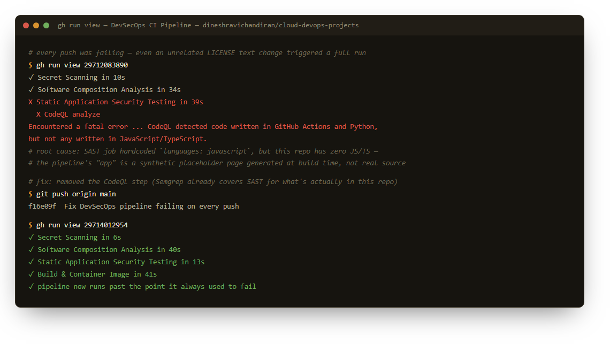

# 🔐 End-to-End DevSecOps CI Pipeline

A production-style CI pipeline that shifts security left and enforces it at every stage of the software delivery lifecycle — from commit to staging deployment.

## Why this exists

Most CI pipelines run tests and call it done. This one treats security as a required gate, not an afterthought: a build cannot reach staging without passing secret scanning, static analysis, dependency auditing, container scanning, and a dynamic scan of the running app.

## Pipeline stages

```
commit
  │
  ▼
[1] Secret Scanning ─────────── Gitleaks (blocks on any credential/token found)
  │
  ▼
[2] SAST ───────────────────── Semgrep (OWASP Top 10 ruleset)
  │
  ▼
[3] SCA ────────────────────── OWASP Dependency-Check (CVE audit of 3rd-party libs)
  │
  ▼
[4] Build ──────────────────── Compile app, build hardened container image
  │
  ▼
[5] Container Scan ─────────── Trivy (fails build on CRITICAL/HIGH CVEs)
  │
  ▼
[6] DAST ───────────────────── OWASP ZAP baseline scan against a running instance
  │
  ▼
[7] Deploy to Staging ──────── gated behind all prior stages passing
  │
  ▼
[8] Security Policy Gate ───── final go/no-go before promotion
```

Findings from Semgrep, Dependency-Check, and Trivy are all uploaded as **SARIF** to the GitHub *Security* tab, so every vulnerability is tracked centrally instead of buried in build logs.

## Stack

| Concern              | Tool                          |
|----------------------|--------------------------------|
| Secret scanning       | Gitleaks                      |
| SAST                  | Semgrep                       |
| SCA / dependency audit| OWASP Dependency-Check         |
| Container hardening   | Multi-stage Dockerfile, non-root user, minimal base image |
| Container scanning    | Trivy                          |
| DAST                   | OWASP ZAP (baseline scan)     |
| Orchestration          | GitHub Actions                |

> **Note:** an earlier version of this pipeline also ran GitHub CodeQL in the SAST stage. Removed it — this repo's "app" is a synthetic placeholder page generated at build time, not real checked-in Java/JS/Python source, so CodeQL had nothing valid to analyze and failed every single run with "no source code seen during build." Semgrep covers static analysis for what's actually in this repo (workflow YAML, Dockerfile). See "Proof this actually runs" below for how that was found.

## Proof this actually runs

This isn't a pipeline that was written once and left — it runs on every push, and for a while it failed on **every single run**, including pushes that had nothing to do with the pipeline itself. Found and fixed three separate real failures blocking it end-to-end (the CodeQL issue above, a missing `issues: write` token permission, and a third-party action's broken artifact upload), re-verifying live in GitHub Actions after each fix:



All 8 stages now pass clean: [](https://github.com/dineshravichandiran/cloud-devops-projects/actions/workflows/devsecops-pipeline.yml)

## Repository layout

```
devsecops-ci-pipeline/
├── .github/workflows/devsecops-pipeline.yml   # the full pipeline definition
├── .zap/rules.tsv                              # ZAP scan rule overrides
├── Dockerfile                                   # hardened runtime image
├── k8s/
│   ├── deployment.yaml                         # Deployment: 2 replicas, non-root, resource limits, probes
│   └── service.yaml                            # ClusterIP Service fronting the container's port 8080
└── README.md
```

## Kubernetes manifests — 📋 Illustrative, not cluster-tested

`k8s/deployment.yaml` and `k8s/service.yaml` show how the image this pipeline builds would actually run on Kubernetes: 2 replicas, the same non-root `securityContext` as the Dockerfile, CPU/memory requests+limits, and readiness/liveness probes against `/`. They haven't been applied against a real cluster — no `kubectl apply` has been run here — so treat them as a correct, reviewed starting point, not a "verified running in prod" claim.

## Design decisions

- **Fail fast, fail cheap**: secret scanning and SAST run before the (more expensive) build step, so leaked credentials or obvious code-level flaws are caught in seconds, not minutes.
- **Every scanner uploads SARIF**: findings become native GitHub code-scanning alerts, so they show up as PR annotations and in the Security tab — no separate dashboard to maintain.
- **Non-root container**: the runtime image drops default Tomcat sample apps/manager consoles and runs as an unprivileged user to shrink the attack surface.
- **Policy gate as its own job**: keeps the "can this go to prod" decision explicit and auditable, separate from the scans themselves.

## Adapting this to a real app

1. Replace the placeholder `Build application` step with your actual `mvn package` / `gradle build` / `ant` invocation.
2. Point `DAST` at a real staging URL once `deploy-staging` provisions one.
3. Add branch protection rules requiring `container-scan` and `sast` as required status checks.
4. Wire `secrets.GITHUB_TOKEN` (already available by default) and any registry credentials as repository secrets — never hardcode them.
